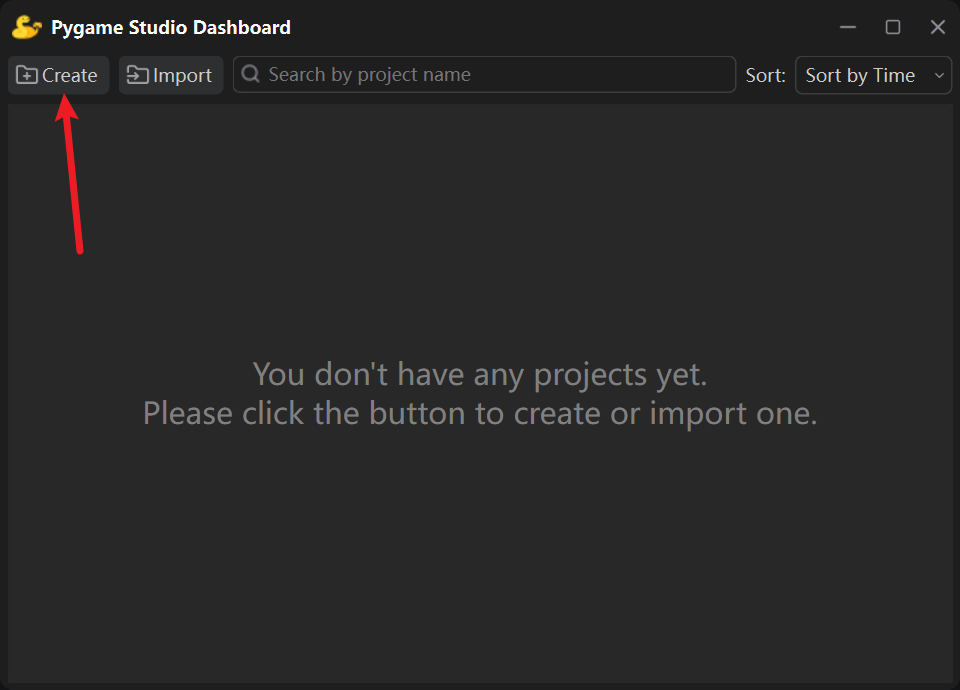
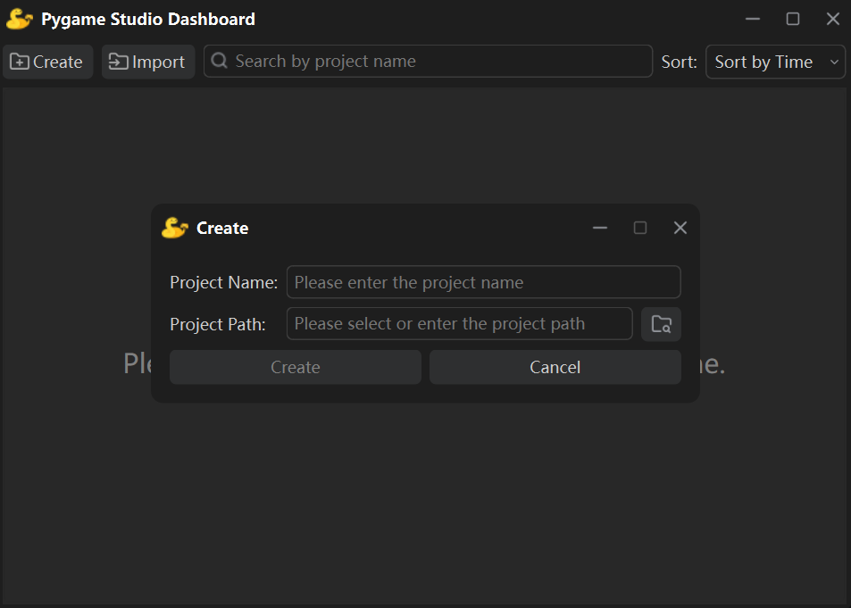
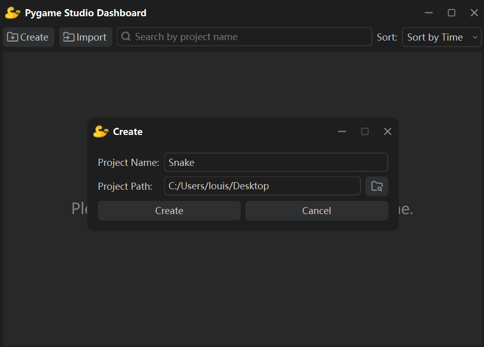
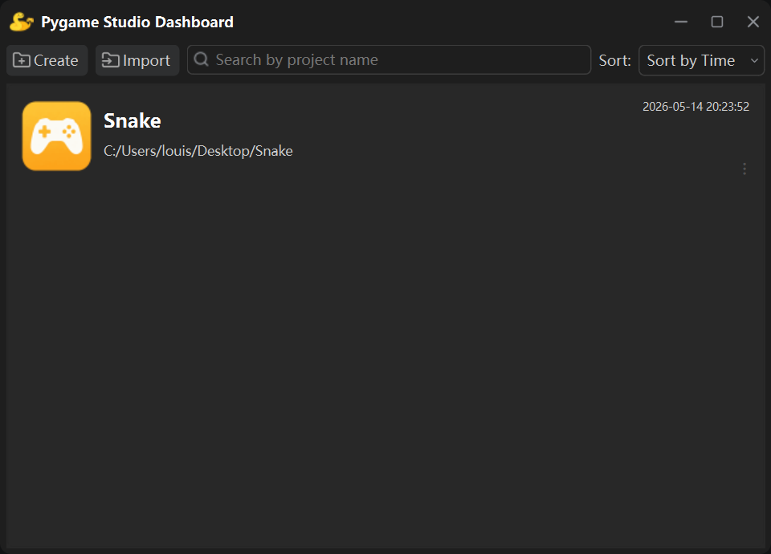
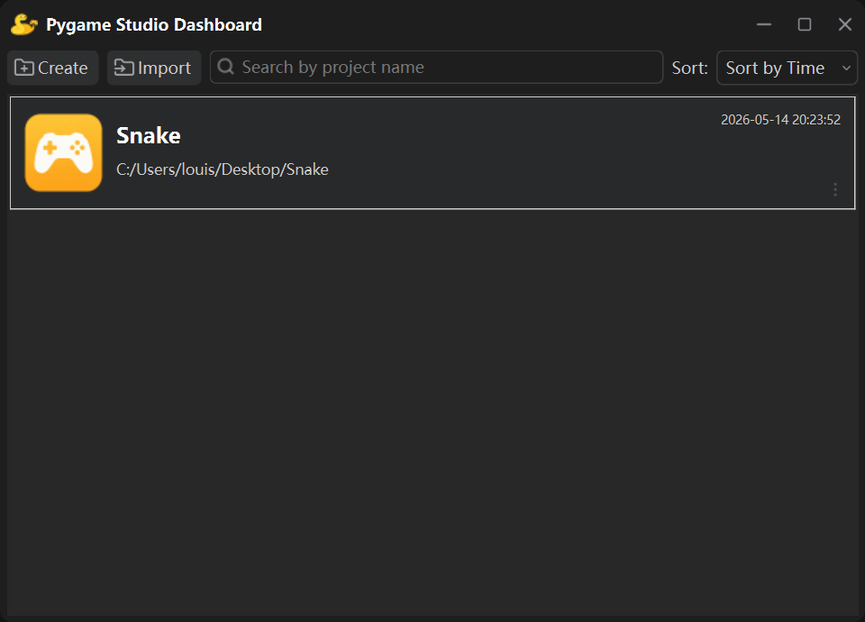
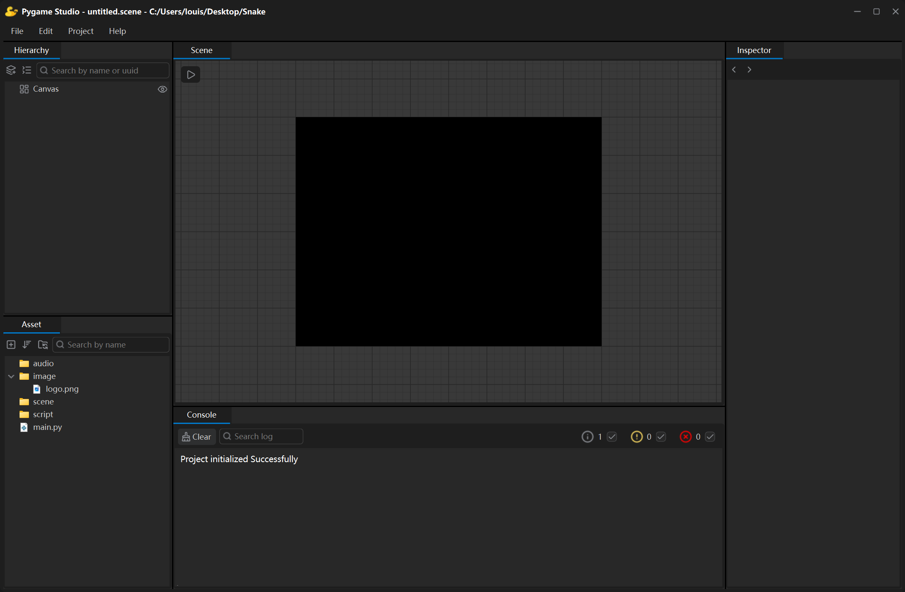
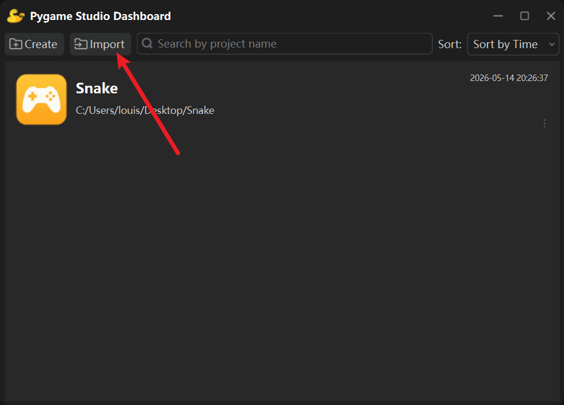

本文将指导你在 Pygame Studio 中完成项目的新建、打开与导入操作。

## 开始创建
点击项目管理面板 (Dashboard) 左上角的**创建按钮**。

在弹出的创建项目对话框中，输入**项目名称**，并选择**项目存放路径**。

比如输入项目名称 Snake，存放路径选择桌面。

填写完成后点击**创建**，即可生成一个新项目，并显示在项目列表中。

## 打开项目
直接**双击项目**，即可进入编辑器开始创作。

进入编辑器后，**左下角为资源窗口**，可以在此查看新项目默认生成的初始文件与文件夹结构。

## 导入已有项目
你也可以将本地已存在的 Pygame Studio 项目导入进来。在 Dashboard 页面点击**导入**按钮。

选中本地已存在的项目文件夹，确认选择即可完成导入。导入后的项目会同步显示在项目列表中，双击即可快速打开。