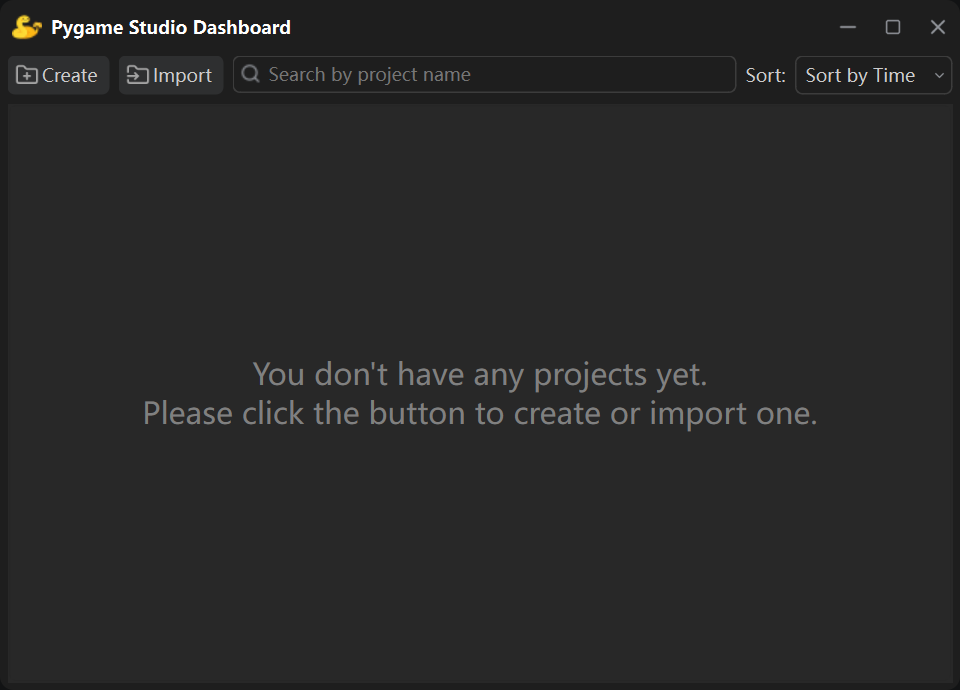

本文将演示如何下载安装 **Pygame Studio** 并验证安装是否成功。

## 前置要求
请确保你的电脑已安装 **Python 3.9 或以上版本**。

你可以在终端中运行以下命令，查看当前 Python 版本：

```bash
python --version
```

## 安装 Pygame Studio
打开终端，执行以下 pip 安装命令：

```bash
pip install --upgrade pygamestudio
```

> **注意：** 目前发布版本均为开发测试版，请务必加上 --upgrade 参数，确保 pip 安装最新开发版，而非本地缓存的旧版本。

执行该命令后，程序会自动下载并安装 Pygame Studio 最新版本，以及所有依赖库。

| 依赖库名称 | 要求版本 |
|-----|-----|
| pygame-ce | >=2.5.6 |
| PySide6 | >=6.10.0 | 
| platformdirs | >=3.5.1 | 
| numpy | >=1.26.0 | 
| pyinstaller | >=6.18.0 | 

## 验证安装是否成功
安装完成后，在终端输入以下命令：

```bash
pygamestudio
```

或使用快捷命令：

```bash
pygs
```

若 Pygame Studio 编辑器正常启动，说明安装完成。



## 下一步
安装完成后，你就可以开始使用 Pygame Studio 创建项目、进行游戏开发了！